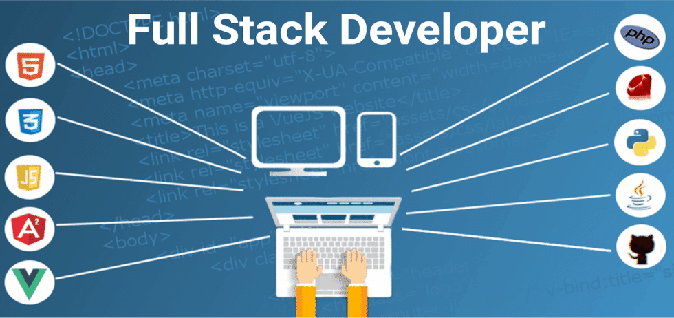

##
### FullStack - HTML, CSS, JavaScript, Bootstrap, Node.
##

<p align="center">
  
</p>


### 1 - INTRODUÇÃO AO PROJETO

**Lista de tarefas**


- Lista de tarefas
    - Uma aplicação frontend com HTML, CSS e JS puro para gerir tarefas
    - No backend vamos ter uma API NodeJS + Express +MySQL para servir o frontend


**Base de dados**


- Base de dados
    - id
    - username
    - password
    - created_at
    - updated_at

    tasks
    - id
    - id_user
    - task_text
    - task_status (new | in progress | canceled | done)
    - created_at
    - updated_at


**Tarefas a desenvolver no projeto**

- Criar a estrutura inicial
    - Base do frontend (html css js | bootstrap)
    - Base do backend (node + express + mysql) com uma resposta padrão


**Frontend**

- No frontend
    - Páginas necessárias para a navegação na nossa app
    - Pequenos testes de comunicação entre frontend e backend - utilização de Ajax (XMLhttprequest | fetchAPI)


- Exemplo
    - fullstack_01


### 2 - PREPARAÇÃO DA ESTRUTURA INICIAL DO FRONTEND

- Ver tarefas
    - Titulo
    - Filtro para escolher que tarefas queremos ver (select)
    - Botão para adicionar tarefas
    - Mensagem sobre o fato de não existirem tarefas
    - Caixa para tarefas
    - Possibilidade de alterar o status, editar tarefa e eliminar tarefa
    - Parágrafo com o total de tarefas disponíveis (de acordo com o filtro)

- Adicionar tarefa
    - Input:text com o texto da tarefa
    - Botão para cancelar
    - Botão para submeter tarefa

- Editar tarefa
    - Input:text para editar o texto da tarefa
    - Botão para cancelar
    - Botão para submeter tarefa

- Eliminar tarefa
    - Eliminar será feita com uma modal


- Estrutura base de cada página
    - Bootstrap (slate) bootswatch
    - Fontawesome


**Bootstrap**

- Slate Bootstrap
    - Site: https://bootswatch.com/slate/


- Exemplo
    - fullstack_02


**Font Awesome**

- FontAwesome
    - Site: https://fontawesome.com/


### 3 - ORGANIZAÇÃO DO LAYOUT DA PÁGINA PRINCIPAL PARTE 1


**Font Awesome**

- FontAwesome
    - Site: https://fontawesome.com/

**Favicon**

- Free Favicon
    - Site: http://freefavicon.com/freefavicons/

- Icon Icons
    - Site: https://icon-icons.com/pt/


**Emmet abrevietion**


- Emmet abrevietion
```html
<!-- comando/atalho

    .container.mt-5>.row>(.col)*2

-->

<!-- Resultado -->
    <div class="container mt-5">
		<div class="row">
			<div class="col"></div>
			<div class="col"></div>
		</div>
	</div>
```


- Emmet abrevietion
```html
<!-- comando/atalho

    .row>.col.text-center

-->

<!-- Resultado -->
    <div class="row">
		<div class="col text-center"></div>
	</div>
```

**Bootstrap**


- Bootstrap
    - Site: https://getbootstrap.com/
    - Forms: https://getbootstrap.com/docs/5.3/forms/select/


- Exemplo
    - fullstack_03


